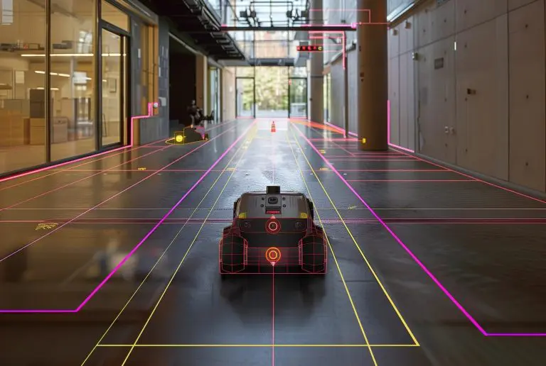
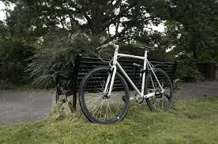

# Photometric-Virtual-Visual-Servoing-based-on-Gaussian-Splatting

## Overview
This project was conducted within the **AI Movement Research Center** as part of a final-year project.  
It focuses on the design and implementation of a **Photometric Visual Servoing (PVS)** approach integrated with **Gaussian Splatting (GS)** — an innovative 3D scene representation technique.

The main goal is to use Gaussian Splatting (GS) to rebuild the 3D scene and help Photometric Visual Servoing (PVS) control the motion of a camera or robot more precisely.
Since GS already includes depth information in its 3D representation, there is no need for extra sensors or heavy depth calculations.
This makes the system simpler, faster, and more stable during camera or robot movement.

*Figure 1 – Overview of Visual Servoing.*

*Figure 2 – Example of 3D scene reconstruction using Gaussian Splatting (GS).*

---

## Scientific Context
In a rapidly evolving technological landscape, **robotics** and **computer vision** play a central role in automation and artificial intelligence.  
A system’s ability to **perceive, interpret, and interact visually** with its environment has become a key factor in applications ranging from autonomous navigation to high-precision robotic control.

This project fits within this context by exploring how **learned 3D scene representations** such as Gaussian Splatting can enhance **photometric visual servoing**.  
It demonstrates that integrating GS into PVS:
- reduces dependency on external sensors,
- simplifies computational requirements,
- and improves environmental understanding and convergence in 3D tracking tasks.

---

## Contributions
This work covers the **entire PVS pipeline**, from algorithm design to its integration with the GS rendering engine.  
The main contributions include:
- Implementation of a **photometric visual servoing algorithm** using image luminance information;
- Integration with the **Gaussian Splatting renderer** for real-time depth-aware visual control;
- Evaluation through **synthetic experiments** showing improved stability and convergence compared to traditional IBVS/PVS approaches.

---

## Results and Experiments
Experiments were conducted to validate the approach under various initial pose perturbations.  
Results show:
- Smooth convergence of the estimated pose toward the desired configuration;
- Reduced photometric and geometric errors;
- Improved robustness in 3D tracking using GS-provided depth information.

A scientific paper based on this work has been **submitted to the IEEE/SICE International Symposium on System Integration (SII 2026)** and is currently **under review**.
